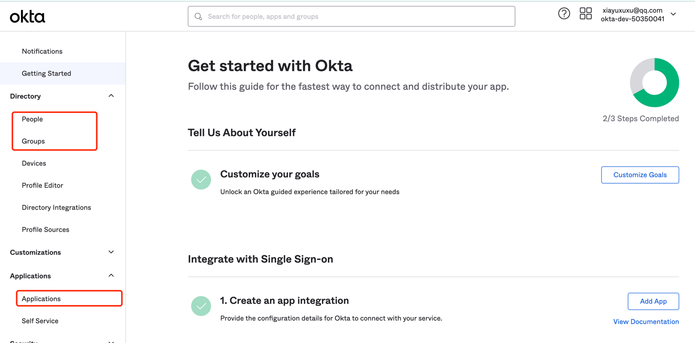
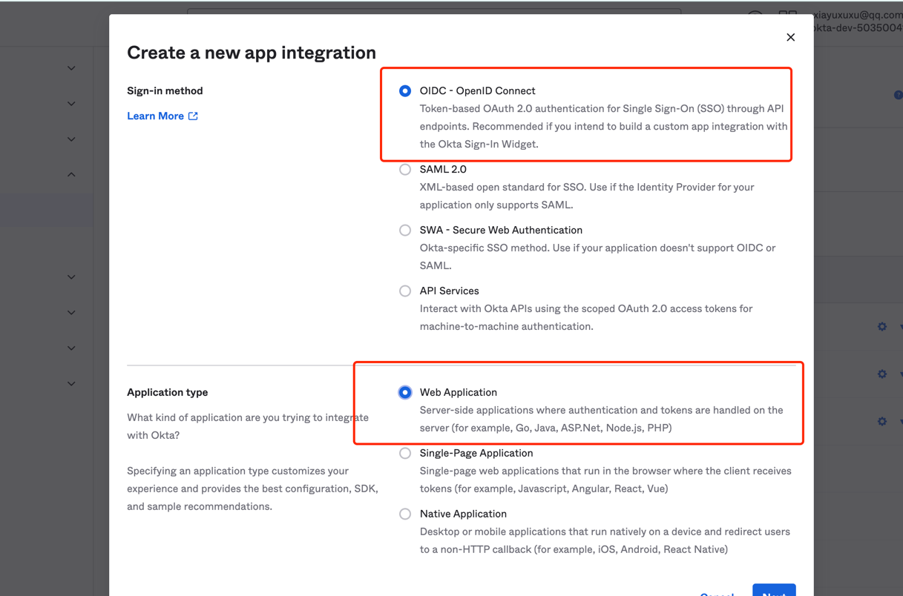
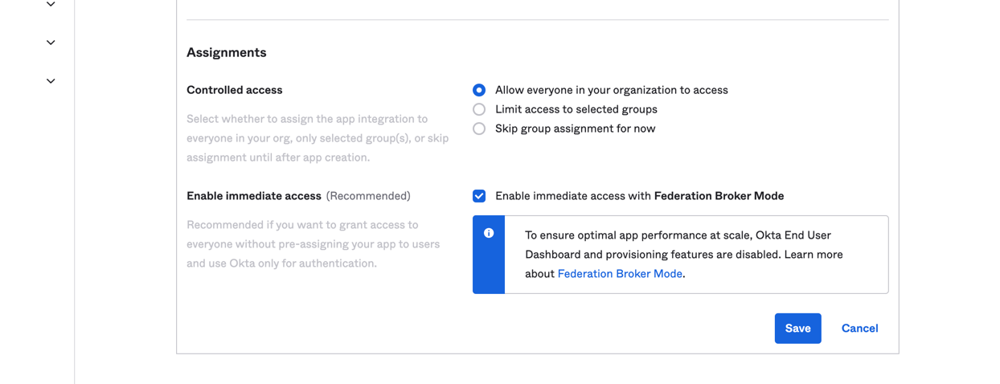
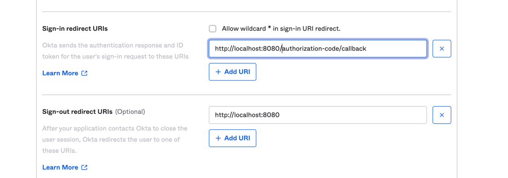

# oidc_demo
    基于oidc协议，实现一个简单的demo，使用Oauth2创建一个授权中心，提供授权服务。同时可以接入其他授权中心，以OKTA的openid为例。

   
OIDC是什么
+ OIDC代表OpenID Connect，它是在OAuth 2.0协议之上构建的身份验证和授权协议。 OIDC提供了一种安全的方法，使用户能够使用其身份验证过程授权第三方应用程序的访问权限。 OIDC使用标准JSON Web令牌（JWT）在OAuth 2.0授权流程的顶部添加了身份验证层。这使得OIDC比传统的OAuth 2.0更安全，因为JWT是使用数字签名进行加密和签名的，因此更难以伪造和篡改。 OIDC还提供更多的用户信息，例如用户的ID和电子邮件地址，这些信息对于开发人员来说非常有用，因为它们可以处理和存储有关用户的详细信息。


## 项目结构
    一个三个项目，authorize_service和authorize_service_jdbc两个都是基于Oauth2搭建的授权中心，区别是是否使用数据库存放用户信息


## OKTA客户端设置
    进入okta官网创建一个账号，设置people和gruops信息
    在application菜单中创建应用程序


随后创建授权中心，选择OIDC模式



设置授权范围



设置登陆，登出的回调地址
我们使用的DEMO使用的是Oauth2，默认回调地址是：/login/oauth2/code/*,所以这里我们可以这是为http://localhost:8081/login/oauth2/code/okta
前面的ip地址是资源服务器的IP地址，当跳转到第三方平台登陆成功后，携带code时回回调该接口，该接口通过code换取用户信息，进行后面的操作。



OKTA配置完成

## 资源端配置
    资源端为Springboot项目
1. pom依赖
```xml
 <dependency>
            <groupId>org.springframework.boot</groupId>
            <artifactId>spring-boot-starter-oauth2-client</artifactId>
        </dependency>

        <dependency>
            <groupId>org.springframework.boot</groupId>
            <artifactId>spring-boot-starter-oauth2-resource-server</artifactId>
        </dependency>
```
2. yml配置
   yml配置参考：https://github.com/spring-projects/spring-security/tree/5.2.1.RELEASE/samples/boot/oauth2login-webflux
   有详细的参数描述
```yml

spring:
  security:
    oauth2:
      client:
        provider:
          okta:
            authorization-uri: https://dev-50350041.okta.com/oauth2/v1/authorize
            token-uri: https://dev-50350041.okta.com/oauth2/v1/token
            user-info-uri: https://dev-50350041.okta.com/oauth2/v1/userinfo
            user-name-attribute: name
            jwk-set-uri: https://dev-50350041.okta.com/oauth2/v1/keys
        registration:

          okta:
            client-id: 0oa8jp0qmnMGgQhFW5d7
            client-secret: yH6jC0lm-9XKa3-KZSTwAvdNO7kIB8JyyQwVg3Bj
            authorization-grant-type: authorization_code
            redirect-uri: "{baseUrl}/login/oauth2/code/{registrationId}"
            scope: "openid, profile, email, address, phone, offline_access"
            client-name: okta

```
完成其他基础配置后就可以启动，回要求跳转到第三方平台登陆后才能访问资源
    


参考文章

openid connect
https://www.baeldung.com/spring-security-openid-connect

Oauth2协议
https://www.rfc-editor.org/rfc/rfc6749#section-2.2

用户信息节点
https://connect2id.com/products/server/docs/api/userinfo